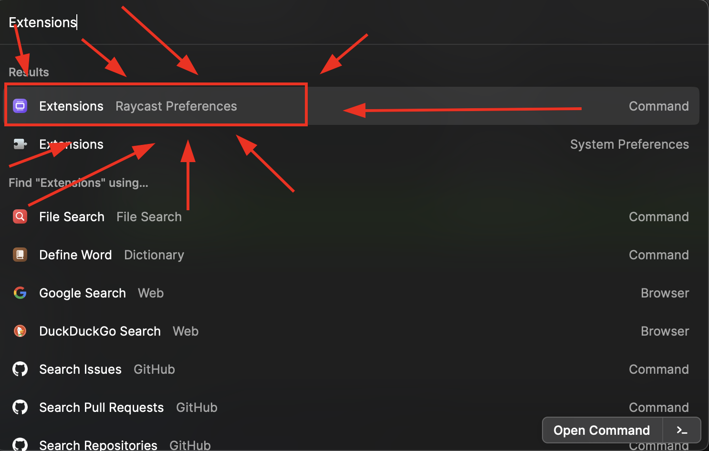
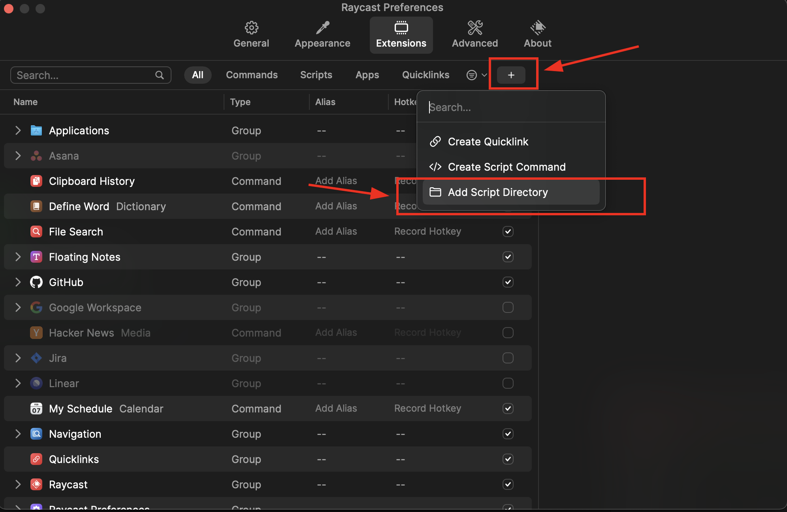

A collection of raycast scripts by yours truly.


Just download my node.js scripts and create a script with these and you're done.


#How do I add these scripts to Raycast??????

First git clone this repository:

```zsh
git clone https://github.com/insomnia-creator/Raycast-Tools
```
Now open Raycast.

Then type extensions and open this result:





Then now in extensions click the '+' button and 'Add script directory'



Choose the folder you git clon-ed to. Then open raycast again by quitting preferences. And voila! 


#haha